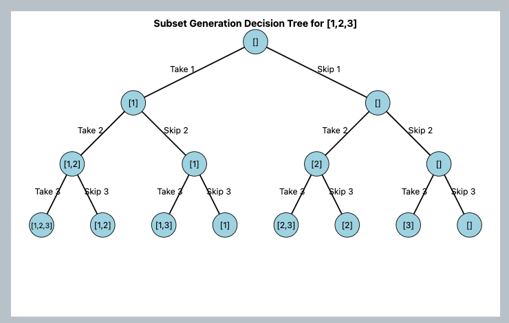
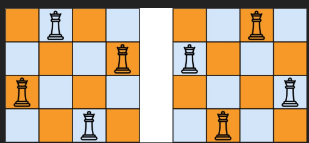
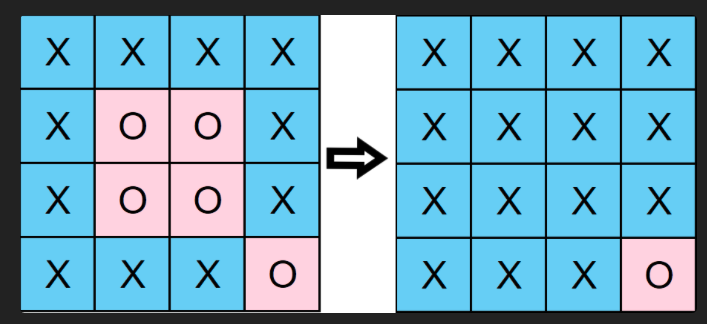

# Interview Algorithm Cheat Sheet

##

Array operations:
Creating an array from indexes 1 to 3 we would use slice
```javascript
array.slice(1,4)
```
Slice operates from index inclusive to an exclusive index. When calling slice(0,1) we will get only 0. Same as when calling slice(1,2) we will receive only 1

## Monotonic Stack

A monotonic stack is a data structure that maintains elements in either strictly increasing or strictly decreasing order. The fundamental insight is that when we violate this order (e.g., pushing a smaller element onto an increasing stack), we can perform meaningful calculations using the elements being removed.

### Key Characteristics
- Each element is pushed and popped exactly once, resulting in O(n) time complexity
- Particularly effective for finding relationships between array elements (next greater/smaller elements, spans, ranges)

### Example Problems
1. **Largest Rectangle in Histogram**
    - Maintain a stack of increasing heights
    - When encountering a smaller height, calculate areas for all larger heights being popped

2. **Daily Temperatures**
    - Maintain a stack of decreasing temperatures
    - When encountering a warmer temperature, update waiting days for all colder temperatures being popped

### Common Applications
- Finding next greater/smaller element
- Calculating ranges and spans
- Identifying the first element that is greater/smaller
- Computing areas under specific constraints

## Binary Search

Binary search is a divide-and-conquer algorithm designed to find elements in sorted collections with O(log n) time complexity.

### Core Concepts
- Repeatedly divide the search interval in half
- Compare the target with the middle element
- Adjust the search space based on the comparison
- Continue until the element is found or the search space is exhausted
- Maintain the loop while the left pointer is less than or equal to the right pointer

### Example Problem
1. **Koko Eating Bananas**
    - Create a range of possible eating speeds
    - Binary search through the range to find the minimum viable speed
    - For each speed tested, calculate whether it's sufficient
    - Continue searching until the pointers cross
    - Return the left pointer value as the optimal solution

### Standard Template
```javascript
const binarySearch = (nums, target) => {
    let left = 0;
    let right = nums.length - 1;

    while (left <= right) {
        const mid = Math.floor((left + right) / 2);

        if (nums[mid] === target) return mid;
        if (nums[mid] < target) left = mid + 1;
        else right = mid - 1;
    }

    return left; // For insertion point
    // return -1; // For exact match only
}
```

### Advanced Techniques
- When searching for a value that may not exist and you need the closest match:
```javascript
while (left <= right) {
    const mid = Math.floor((left + right) / 2);
    // Save the current value if it's less than or equal to the target
    // Continue searching to ensure it's the closest match
    if (existing[mid].timestamp <= timestamp) {
        res = existing[mid].value;
        left = mid + 1;
    } else {
        right = mid - 1;
    }
}
```

- For problems like "Median of Two Sorted Arrays":
    - Iterate through one array while calculating the corresponding position in the second array
    - Use separator indices instead of value indices since one array might contain all target values
    - Right pointer starts at array length (not length - 1) when using separator indices
    - Handle edge cases by treating values beyond array bounds as infinity or negative infinity

## Linked List

### Key Operations
- Traversal: Use `current = current.next`
- Reversal: Utilize `prev` and `current` pointers, with `prev` initially null until it receives the final value

### Considerations
- Removing a node at index zero requires special handling
- When storing nodes inside a map, use a native Map object for proper functionality
- Calling .next on null throws an error. Always check if head/current exists before accessing .next

```javascript
while (cursor) {
    const cloned = map.get(cursor);
    // Check if next exists before accessing
    if (cursor.next) {
        cloned.next = map.get(cursor.next);
    }
}
```

### List Reversal Template
```javascript
const reverseList = function(head) {
    if (!head || !head.next) {
        return head;
    }

    let prev = null;
    let current = head;
    while (current) {
        const tempNext = current.next;
        current.next = prev;
        prev = current;
        current = tempNext;
    }

    return prev;
}
```

### Floyd's Cycle-Finding Algorithm (Floyd's Tortoise and Hare)
- Uses two pointers: a slow pointer moving one step and a fast pointer moving two steps
- If there's a cycle, the pointers will eventually meet
- Finding the cycle entry point:
  A. Execute fast and slow pointers (fast +2, slow +1) until they meet
  B. Keep slow at current position, create another slow pointer at head, move both until they meet
  C. This works because mathematically, the distance from meeting point to cycle entry equals the distance from start to cycle entry
- This algorithm can detect duplicates in an array when all numbers are within bounds

#### Cycle Detection Template
```javascript
const hasCycle = function(head) {
    if (!head || !head.next) return false;

    let slow = head;
    let fast = head.next;

    while (fast && fast.next) {
        if (fast === slow) return true;
        slow = slow.next;
        fast = fast.next.next;
    }

    return false;
}
```

- When measuring a length of a range within a linked list, we should verify next exits before extending or else we would end up having right side as null

```javascript
        let left = head; 
        let right = head; 
        let count = 1;
        while (count < k && right.next) { // We make surer right.next exist within K range in order to return a none null right even if K is lower. 
            right = right.next;
            count++ 
        }
```


### Advanced Applications
- Problems like "Reorder Linked List" [0, n-1, 1, n-2, 2, n-3, ...] might seem to require O(n) space for reverse traversal
- However, using Floyd's algorithm, you can perform in-place reordering by working backwards from the middle of the list, which does not require extra space

### LRU Cache
- Updates most recently used items on new insertions AND get operations
- On existing values, updates both the value and marks as most recently used
- The key implementation details include:
    - Handling case with no first node
    - Handling case with no last node
    - Setting last.next as null and updating prev pointers correctly
    - Maintaining both first and last pointers accurately

```javascript
class Node {
    constructor(key, val) {
        this.key = key;
        this.val = val;
        this.next = null;
        this.prev = null;
    }
}

class LRUCache {
    constructor(capacity) {
        this.capacity = capacity;
        this.size = 0;
        this.first = null;  // least recently used
        this.last = null;   // most recently used
        this.map = new Map();
    }

    get(key) {
        const node = this.map.get(key);
        if (!node) return -1;

        this.moveToEnd(node);
        return node.val;
    }

    moveToEnd(node) {
        if (node === this.last) return;

        // Remove from current position
        if (node === this.first) {
            this.first = node.next;
            this.first.prev = null;
        } else {
            node.prev.next = node.next;
            node.next.prev = node.prev;
        }

        // Add to end
        this.last.next = node;
        node.prev = this.last;
        node.next = null;
        this.last = node;
    }

    put(key, value) {
        const existingNode = this.map.get(key);

        if (existingNode) {
            existingNode.val = value;
            this.moveToEnd(existingNode);
            return;
        }

        const newNode = new Node(key, value);
        this.map.set(key, newNode);

        if (this.size === 0) {
            this.first = newNode;
            this.last = newNode;
        } else {
            this.last.next = newNode;
            newNode.prev = this.last;
            this.last = newNode;
        }

        if (this.size === this.capacity) {
            this.map.delete(this.first.key);
            this.first = this.first.next;
            if (this.first) {
                this.first.prev = null;
            }
        } else {
            this.size++;
        }
    }
}
```

### Merge sort
- Splitting in half multiple times until left with the smallest denominator, in some cases that would be a single element, other, a single sorted list
- Then we merge using left to right comparison of sorted arrays
- Very good for linked lists since operations of adding is O(1) 

In the question "Merge K Sorted Linked Lists" we use merge sort to merge multiple already sorted arrays.
If usually such an operation would take N * K, with merge sort it gows down to N log K since we are only merging halfs, so much less operations in total.
Also space is pretty officiant with N Log K 

```javascript

class Solution {
    mergeSort(listA, listB) {
        if (!listA) return listB;
        if (!listB) return listA;

        let initial = new ListNode(null, null);
        let res = initial;

        while (listA && listB) {
            if (listA.val < listB.val) {
                initial.next = listA;
                initial = initial.next;
                listA = listA.next;
            } else {
                initial.next = listB;
                initial = initial.next;
                listB = listB.next;
            }
        }

        if (listA) initial.next = listA;
        if (listB) initial.next = listB;

        return res.next;
    }
    
    divide(lists, left, right) {
        if (right < left) return null;
        if (left === right) return lists[left];

        const length = right - left;
        const half = left + Math.floor(length / 2); // we must start from the left or else we would be pointing at a much to earlier 

        const leftMerge = this.divide(lists, left, half);
        const rightMerge = this.divide(lists, half +1, right);

        return this.mergeSort(leftMerge, rightMerge);        
    }

    mergeKLists(lists) {   
        return this.divide(lists, 0, lists.length -1)
    }
}

```

## Binary tree

- Binary tree "depth" is the longest path from root to bottom, the "breadth" is the width
- Traversing would be via recursive or stack, both usually take O(Height) space
- Traversing is normally left to right
- Level order traversal is one that needs a queue
- Global state often managed via closure variables in nested functions
- Bottom-up calculations: Child nodes return values to parent nodes
- Top-down calculations: Parent passes accumulated values to children
- Balanced tree: Height difference between left and right subtrees is at most one (on every)
- If a tree is not balanced recursive iteration could take O(N) in the worst case
- When creating a hash representation of tree structure, we have to make sure to specify which are each nodes left and right, or else could have collisions

```javascript
    const hash = `(L:${getHash(node.left)},V:${node.val},R:${getHash(node.right)})`;
    // and not
    const hash = `${getHash(node.left)}:${node.val}${getHash(node.right)}`;

```

Since there would have the same value

```markdown
10
/
5
 \
  4

10
 \
  4
   \
    5
```

Given a tree:

```markdown
        1
      /  \
    2      3
   / \    / \
   4 5   6   7
```

In order traversal would mean visiting left, middle and right 

4, 2, 5, 1, 6, 3, 7

Pre order would mean visiting root before (Notice values are printed before the in order which would start from the bottom right)

1, 2, 4, 5, 3, 6, 7

Post order traversal would mean visiting middle last

4, 5, 2, 6, 3, 7, 1

Level order traversal is normally using a queue

1, 2, 3, 4 ,5, 6, 7

### Edges and Nodes

- Edges are the lines connecting nodes
- Nodes are the values within the tree

In the following example there is one edge and two notes
```markdown
    A
   /
  B
```

### Balanced Binary Tree

```javascript
    var isBalanced = function(root) {
        // global variable
        let isBalanced  = true;
        var helper = function(node) {
            if (!node) return 0;
            // call left and right
            const left = helper(node.left);
            const right = helper(node.right);
         
            const min = Math.min(left, right);
            const max = Math.max(left, right);
            // run internal calculation while updating global variable
            if (max - 2 >= min) isBalanced = false;
            // return max left or right while adding additioanl + 1
            return Math.max(left, right) + 1;
        }
        helper(root);
        return isBalanced;
    }
```

### Level traversal

There is a trick using a queue & a for-loop. The queue represents the "next level", but could contain also the "next next" level while we iterate over level
Adding next. For that we use a for loop which remembers how many nodes are in the  current level.

```javascript
 var levelOrder = function(root) {
        if (!root) return [];
        let stack = [root];
        let res = [] 

        while (stack.length) {
            const count = stack.length; 
            let resNextLevel = []
            for (let i = 0; i < count; i ++) {
                const current = stack.shift();
                resNextLevel.push(current.val); 
                if (current.left) stack.push(current.left); 
                if (current.right) stack.push(current.right);             
            }
            res.push(resNextLevel);
        }

        return res;
    }
```

### Binary search tree

- A binary search tree is a binary tree where the left child is less than the parent and the right child is greater than the parent
- When validating a tree is valid, we must pass the min and max values to each node, since checking only with direct siblings could return true,
While in the bigger picture it would be false (see 3 is not bigger than 5). Every node should check if under the current branching min/max.

```markdown
     5
    / \
   4   6
      / \
     3   7
```

- Construct Binary Tree from Preorder and Inorder Traversal: we are using the fast preorder first node is always the root.
Than we create a root node, and set left and right side to recursive calls, while splitting in order via searching the root we found,
And spliting the preorder using the count from pre order 

```markdown
              1
             /. \
            2.   3
          /  \.  / \
          4.  5 6.  7
         /
        8

preorder =    [1, 2, 4, 8, 5, 3, 6, 7]
inorder =     [8, 4, 2, 5, 1, 6, 3, 7]

   preorder = [1, 2, 4, 8, 5, 3, 6, 7] -> First one is root
               ^
inorder =     [8, 4, 2, 5,] 1 [ 6, 3, 7]
                            ^
```

```javascript
    buildTree(preorder, inorder) {
        var helper = function(preorderStart, preorderEnd, inorderStart, inorderEnd) {
            if (preorderStart > preorderEnd) return null;
            const node = new TreeNode(preorder[preorderStart]);
            let inorderIndex = 0;
            for (let i = inorderStart; i <= inorderEnd; i ++) {
                if (inorder[i] === preorder[preorderStart]) {
                    inorderIndex = i;
                }
            }
            const leftSideLength = inorderIndex - inorderStart;

            const newPreorderLeftEnd = preorderStart + 1 + leftSideLength - 1;
            node.left = helper(preorderStart + 1, newPreorderLeftEnd, inorderStart, inorderIndex - 1);
            node.right = helper(newPreorderLeftEnd + 1, preorderEnd, inorderIndex + 1, inorderEnd)

            return node;
        }
        return helper(0, preorder.length -1, 0, inorder.length - 1);
    }
```

### 297. Serialize and Deserialize Binary Tree

- We are to serialize and deserialize a binary tree. But there is a trick using pre order traversal which is not trivial.
Normally one would try solving this using level travers, but the serialization would be more expensive.
Here is an example how to do the simplified way:

```javascript
  var serialize = function(root) {
    if (!root) return 'N';

    return root.val + ',' + serialize(root.left) + ',' + serialize(root.right);
};
```
This would be a possibly output ''1,2,N,N,3,N,N'

And the deserialization would be:

```javascript
var deserialize = function(data) {
    if (data === '') return null;
    const arr = data.split(',');

    let index = 0; // we are using index rather than popping array for better permofmance

    var dfs = function() {
        if (index > data.length - 1) { // nothing to do when reaching the end
            return null;
        }
        if (arr[index] === 'N') { // we trast N as null, and moving index forwards
            index++;
            return null;
        }
        
        const node = new TreeNode(parseInt(arr[index]));
        index++;
        // same dfs as was constructed, pre order traversal
        node.left = dfs();
        node.right = dfs();

        return node;
    }

    return dfs();
};
```

Given the following string '1,2,N,N,3,N,N'

We would construct the 1, than 2, 2 left and right would be bull
Continue to 1 right side, 3, 3 left and right would be null

----------------------


## Min heap


- A min heap is a binary tree where the parent is always smaller than the children
- Accessing parent is using Math.floor((i - 1) / 2)
- Accessing left child is using 2 * i + 1
- Accessing right child is using 2 * i + 2
- Given a question we need to find the smallest x values in a list of length y, a use of a min heap would be
y log y, but actually, if using a max heap, we could make sure the heap is always of length x and that way deduct time
complexity to y log x. Pushing values and every time we have more than x values, pop the next max (staying with min values)
- Building a heap is O(n) since we are iterating over all values and heapifying up. This is counterintuitive since every operation is log n, but actually
We are doing it in a way that we are not doing it for every value, but only for the ones that are needed to be moved up which terns out to be N.


```javascript
class MinHeap {
    constructor() {
        this.heap = [];
    }

    swap(a, b) {
        const tempA = this.heap[a];
        this.heap[a] = this.heap[b];
        this.heap[b] = tempA;
    }

    heapifyUp() {
        let index = this.heap.length -1;

        while (index > 0) {
            const parentIndex = Math.floor((index - 1) / 2);
            if (this.heap[parentIndex] < this.heap[index]) break;

            this.swap(parentIndex, index);
            index = parentIndex;
        }
    }

    insert(value) {
        if (!this.heap.length) {
            this.heap.push(value);
            return;
        }

        this.heap.push(value);
        this.heapifyUp();
    }

    heapifyDown() {
        let index = 0;

        while (index < this.heap.length) {
            const leftChild = index * 2 + 1;
            const rightChild = index * 2 + 2;

            let minIndex = index;

            // Notice we are comparing both to each other by using minIndex. We will pick the lowest child 
            if (leftChild < this.heap.length && this.heap[leftChild] < this.heap[minIndex]) {
                minIndex = leftChild;
            }
            if (rightChild < this.heap.length && this.heap[rightChild] < this.heap[minIndex]) {
                minIndex = rightChild;
            }

            if (minIndex === index) break;

            this.swap(minIndex, index);
            index = minIndex;
        }
    }

    extractMin() {
        if (!this.heap.length) return null;
        if (this.heap.length === 1) return this.heap.pop();

        this.swap(0, this.heap.length -1);
        const removed = this.heap.pop();
        if (this.heap.length === 1) return removed;

        this.heapifyDown();

        return removed;
    }

    peek() {
        if (!this.heap.length) return null;
        return this.heap.length[0];
    }
}
```

## Bucket count "Last stone weight"

- We are needed to find the highest stones each time and negate or remove them
- Because of the constraint of max size of stone, we are able to instead of using a heap which
Would be n log n, we use buckets correlated to size of stones, and find the heights one each time
In constant time.

```javascript
var lastStoneWeight = function(stones) {
    if (!stones.length) return null;

    let max = stones[0]; // 6
    for (let stone of stones) {
        max = Math.max(max, stone);
    }

    let bucket = new Array(max + 1).fill(0);
    for (let stone of stones) {
        bucket[stone] ++;
    }

    let first = max; // 3

    while (first > 0) {
        if (bucket[first] > 1) {
            bucket[first] -= 2;
            continue;
        }

        while (first > 0 && bucket[first] === 0) first--;
        if (bucket[first] > 1) {
            bucket[first] -= 2;
            continue;
        }

        let second = first - 1; // 2
        while (second > 0 && bucket[second] === 0) second --;

        if (second === 0) return first;

        bucket[first - second] ++;
        bucket[first] --;
        bucket[second] --;
    }

    return 0;
};
```

### Finding the closes point to the origin

- Calculating distance between two points is using sqrt((x1 - x2)^2 + (y1 - y2)^2)
- Finding from 0,0 in javascript would simply be   Math.pow(value[1], 2) + Math.pow(value[0], 2);


## Quick sort / select

- Quick sort is essentially pivot sort. Choosing a random number and making sure it’s left and right are smaller and bigger, so it’s in the right place in the array, than doing the same for left and right
- Quick sort avr time complexity is N log N, because if we manage to pick a pivot that splits in half the array, we are sorting half each time.
- But if not, we will continue sorting the same size -1 which would become N ^ 2
- Quick select is a method of sorting only one relevant side each time, for example when searching for largest X number.
- Quick select avr time complexity is N since we split to have and sort only one half. This is not log n like binary search because in binary search at each step we just split to have (constant time) but here we actually iterate over all array elements at each level. It’s actually N + Log N but we removing the Log N since smaller than N.

```javascript
function partition(arr, left, right) {
    let pivot = right;
    let leftBorder = left - 1; 

    // We want to move smaller elements to the left
    for (let i = left; i < right; i ++ ) { // we move until the pivot number
        if (arr[i] < arr[pivot]) {
            leftBorder ++;
            [arr[i], arr[leftBorder]] = [arr[leftBorder], arr[i]];
        }
    }

    [arr[leftBorder + 1], arr[pivot]] = [arr[pivot], arr[leftBorder + 1]];
    return leftBorder + 1;
}


function quickSort(arr, left, right) {
    if (arr.length === 1) return arr;
    if (left >= right) return arr;
    
    const pivot = partition(arr, left, right);

    quickSort(arr, left, pivot - 1);
    quickSort(arr, pivot + 1, right);
    return arr;
}
```

### Quick select

```javascript
function quickSelect(arr, left, right, k) {
    if (left === right) return arr[left];

    const pivot = partition(arr, left, right);

    if (pivot === k) return arr[pivot];
    if (pivot < k) return quickSelect(arr, pivot + 1, right, k);
    return quickSelect(arr, left, pivot - 1, k);
}
```

## Subsets

- Finding all possible none duplicate subsets is a recursive operation that at each point we decide rather we want to add or not add the number
- Because we choose if to add or not, it's 2 ^ N since we have 2 options for each number. But because in this case we are also constructing an array which is 
a N operation, we are actually N * 2 ^ N

```javascript
var subsets = function(nums) {
        let res = [[]]
        let helper = function(start, arr) {
            for (let i = start; i < nums.length; i ++) {
                let next = [...arr]
                next.push(nums[i]);
                res.push(next);
                helper(i + 1, next)
            }
        }

        helper(0, []);
        return res;
};
```

## Combination Sum (understanding time complexity)

- Given a list of numbers and a target, we are to find all possible combinations that would sum up to the target
- Numbers can be repeated, for example, [2, 3, 6, 7] and target 7 would have [2, 2, 3] and [7]

In order to solve this, we iterate on all numbers while calling recursively passing current index onwards.
This may seem like a N^N time complexity, but actually we should look at each branch number of decisions.
We may start with N branches, but each branch only has 2 decisions, rather to add current number or not.

2^(N-1) + 2^(N-2) + 2^(N-3) + ... + 2^0

For that reason the time complexity is 2^N

```javascript
function combinationSum(nums, target) {
        let res = [];

        let helper = function(index, arr, sum) {
            // because we pass the index it's a 2 ^ N and not n^n
            for (let i = index; i < nums.length; i++) {
                const num = nums[i];

                if (num + sum > target) continue;
                if (num + sum === target) {
                    arr.push(num);
                    res.push([...arr]);
                    arr.pop();
                    continue;
                }

                arr.push(num);
                helper(i, arr, sum + num);
                arr.pop();
            }
        } 

        helper(0, [], 0);

        return res;
    }
```

## Combination Sum II (And how to skip duplicates)

In this case, we are to find all possible combinations that would sum up to the target, but we are not allowed to use the same number twice.
The tricky case is given this input 1,2,2,2,5 and target 5, we should have return [1,2,2] twice. Just once. 
In order to do so, we sort the input, and after a recursive call OR a final solution we skip all duplicates.

If we would not skip duplicates after adding to res array, we would move 1 index forward that could contain the same number again.

`Example: 1,2,2,2,5 in the case after adding 1,2,2 we do not want to continue to the index 3 2`

If we would not skip duplicates after each recursive call, we would have the same problem but in the middle or start of the result.

`Example:  1,2,2,2,5 after adding 2,2 5 we do not want to add another 2,2,5`

Two different cases, two are must.

```javascript
 function combinationSum2(candidates, target) {
        let res = [];
        candidates = candidates.sort((a,b) => a - b);

        let helper = function(arr, index, sum) {
            for (let i = index; i < candidates.length; i ++) {
                const num = candidates[i];

                if ((sum + num) === target) {
                    arr.push(num);
                    res.push([...arr]);
                    arr.pop();
                    // We skip here 
                    while (candidates[i + 1] === candidates[i]) i++;
                    continue;
                }

                if ((sum + num) > target) continue;

                arr.push(num);
                helper(arr, i + 1, sum + num);
                arr.pop(); 
                // And skip here
                while (candidates[i + 1] === candidates[i]) i++;
            }
        }

        helper([], 0, 0);

        return res;
    }
```

Alternatively (and more recommended), we could skip checking current is not equal previous using the passed index.
Only check if the i is bigger than index and by this guaranteeing number only shows once per index.
We allow picking a chain of numbers once, for example 1,2,2,2,2,3 and the next time all 2 would be skipped.

```javascript
function combinationSum2(candidates, target) {
        let res = [];
        candidates = candidates.sort((a,b) => a - b);

        let helper = function(arr, index, sum) {
            for (let i = index; i < candidates.length; i ++) {
                // This is the trick here
                if (i > index && candidates[i -1] === candidates[i]) continue;

                const num = candidates[i];

                if ((sum + num) === target) {
                    arr.push(num);
                    res.push([...arr]);
                    arr.pop();
                    continue;
                }

                if ((sum + num) > target) continue;

                arr.push(num);
                helper(arr, i + 1, sum + num);
                arr.pop(); 
            }
        }

        helper([], 0, 0);

        return res;
    }
```


This is the trick of skipping duplicates

```
 if (i > index && nums[i -1] === nums[i]) continue;
```

## Permutations (without copying arrays)

- Given a list of numbers, we are to find all possible permutations
Example:
- 
Input: nums = [1,2,3]

Output: [[1,2,3],[1,3,2],[2,1,3],[2,3,1],[3,1,2],[3,2,1]]

The most trivial way to solve this would be iterating while creating new arrays with the missing index and the new permutation array.
But this would add to the time complexity since we are creating new arrays each time.
Instead, we can iterate while swapping the order of items in the array and then swapping back to the original order.

```javascript
    function permute(nums) {
        let res = [];

        let helper = function(index) {
            if (index === nums.length) {
                res.push([...nums]);
                return;
            }
            for (let i = index; i < nums.length; i ++) {
                swap(nums, i, index);
                helper(index + 1); 
                swap(nums, i, index);
            }
        }

        helper(0)

        return res;
    }
```

The time complexity in this case seems like N^N but we are actually have N-1 at branching at each level, so it's N!
Notice this last question time complexity is MUCH higher than the previous ones, since we are actually creating N! arrays.

## Subsets II (Understanding time complexity)

Example input and output 

```
Input: nums = [1,2,1]

Output: [[],[1],[1,2],[1,1],[1,2,1],[2]]
```

Actual implementation:

```javascript
  function subsetsWithDup(nums) {
        let res = [];
        nums = nums.sort((a, b) => a - b);

        let helper = function(index, arr) {
            res.push([...arr]);
            for (let i = index; i < nums.length; i ++) {
                if (i > index && nums[i -1] === nums[i]) continue;
                const num = nums[i];
                arr.push(num);
                helper(i + 1, arr);
                arr.pop();
            }
        }

        helper(0, []);

        return res;
    }
```

It may seem like we have N options at each level because of the for loop, but we actually have just 2.
If we visualize it, it looks like so: (for [1,2,3])

The total time complexity is 2^n * n (since we are creating an array at each level)



## Palindrome Partitioning (and how to calculate all possible partitions)

Example: Input: s = "aab"

Output: [["a","a","b"],["aa","b"]]

The question was tricky to me at first, because I did not understand as long as we calculate all polindrom from
i to j, and call recursive, all of them would be found.

If we have a , b , c, d, d, c

As long as we try every match

a √
ab x
abc x
....

then do the same for

a √
b ∫
cddc √

We will find all possible partitions

```javascript
function isPolindrom(s, start, end) {
    if (start >= end) return true;
    if (s[start] !== s[end]) return false;
    return isPolindrom(s, start +1, end -1);
}

function partition(s) {
    let res = [];
    
    let helper = function(index, arr) {
        if (index >= s.length) {
            res.push([...arr]);
            return;
        }
        for (let i = index; i < s.length; i ++) {
            if (isPolindrom(s, index, i)) {
                arr.push(s.substring(index, i + 1));
                helper(i + 1, arr);
                arr.pop();
            }
        }
    }

    helper(0, []);

    return res;
}
```

### N Queens

- Given a board of size N x N, we are to find all possible ways to place N queens on the board



This is a classic situation of time complexity n! since at each level we have n-1 options.
n -1, n-2, n-3....

### Design Add and Search Word Data Structure (Trie search time complexity)

Examples 

wordDictionary.addWord("day");
wordDictionary.addWord("bay");
wordDictionary.addWord("may");
wordDictionary.search("say"); // return false
wordDictionary.search("day"); // return true
wordDictionary.search(".ay"); // return true
wordDictionary.search("b.."); /
/ return true

The time complexity is 26^m where m is the length of the word, because on each level we have 26 characters possibly
and every time we have another 26 possibilities as long as there are * in the word.


# Graphs

## Cloning graphs:

### Recursive

We are creating nodes or returning existing clone, then calling recursive on each child

```javascript
function cloneGraph(node) {
        // base case important to remember or else ".val" of undefined will throw
        if (!node) return node;
           let map = {};

    let helper = function(currentNode) {
        if (map[currentNode.val] !== undefined) return map[currentNode.val];

        const nodeClone = new Node(currentNode.val);
        // this is important, to set fast, or else it would be infinite recursion
        map[currentNode.val] = nodeClone;
        let cloneNeighbors = [];
        for (let n of currentNode.neighbors) {
            cloneNeighbors.push(helper(n))
        }

        nodeClone.neighbors = cloneNeighbors;
       
        return nodeClone;
    }

    helper(node);

    return map[node.val];
    }
```

We can do the same thing using stack, in this case we would create all children and push
Then to stack. So when iterating on children we would not push if already found

```javascript
function cloneGraph(node) {
        if (!node) return null;

        let stack = [node];
        let clones = {};
        clones[node.val] = new Node(node.val);

        while (stack.length) {
            const original = stack.shift();
            const clone = clones[original.val];

            for (let neighbor of original.neighbors) {
                if (clones[neighbor.val] === undefined) {                
                    const neighborClone = new Node(neighbor.val);
                    clones[neighbor.val] = neighborClone
                    clone.neighbors.push(neighborClone)
                    stack.push(neighbor)

                } else {
                    // This is really important to remember for recursive calls 
                    if (!clone.neighbors.includes(clones[neighbor.val]) 
                        clone.neighbors.push(clones[neighbor.val])
                }
            }
        }        

        return clones[node.val]
    }
```

### Islands and Treasure 

This question input is a matrix that each cell could be one of 3 values:
0 treasure
-1 water, can not traverse
2147483647 big number

We should return a matrix the each big number shows the distance to the closest treasure.

```markdown
Input: [
  [2147483647,-1,0,2147483647],
  [2147483647,2147483647,2147483647,-1],
  [2147483647,-1,2147483647,-1],
  [0,-1,2147483647,2147483647]
]

Output: [
  [3,-1,0,1],
  [2,2,1,-1],
  [1,-1,2,-1],
  [0,-1,3,4]
]
```

At first it may seem like a problem of time complexity:

Number of treasure * board size, since we would have to bfs on each one.
But the trick is traversing from all of the treasures together!
Which terms out to be time complexity of board size, single iteration.

```javascript
islandsAndTreasure(grid) {
        if (!grid.length || !grid[0].length) return grid;

        let queue = [];

        for (let y = 0; y < grid.length; y ++) {
            for (let x = 0; x < grid[0].length; x ++) {
                if (grid[y][x] === 0) {
                    queue.push({y, x, steps: 0})
                }                
            }
        }

        while (queue.length) {
            const next = queue.shift();
            let steps = next.steps + 1;

            if (next.y > 0 && grid[next.y -1][next.x] === 2147483647) {
                grid[next.y -1][next.x] = steps;
                queue.push({x: next.x, y: next.y -1, steps});
            }
            if (next.x > 0 && grid[next.y][next.x -1] === 2147483647) {
                grid[next.y][next.x -1] = steps;
                queue.push({x: next.x -1, y: next.y, steps});
            }
            if (next.y < grid.length -1 && grid[next.y +1][next.x] === 2147483647) {
                grid[next.y + 1][next.x] = steps;
                queue.push({x: next.x, y: next.y + 1, steps});
            }
            if (next.x < grid[0].length && grid[next.y][next.x + 1] === 2147483647) {
                grid[next.y][next.x + 1] = steps;
                queue.push({x: next.x + 1, y: next.y, steps});
            }
        }

        return grid;
    }
```

### Rotting Fruit

You are given a 2-D matrix grid. Each cell can have one of three possible values:
0 representing an empty cell
1 representing a fresh fruit
2 representing a rotten fruit

Every minute, if a fresh fruit is horizontally or vertically adjacent to a rotten fruit, then the fresh fruit also becomes rotten.

Return the minimum number of minutes that must elapse until there are zero fresh fruits remaining. If this state is impossible within the grid, return -1.

- The trivial think is to use the same method of extending via bfs from all rotten fruits
- But the time is something should remember to start from -1 or else what be counting invalid
- And at the end we must iterate again to validate there are no left fruits

```javascript
    function orangesRotting(grid) {
        if (!grid.length || !grid[0].length) return 0

        let queue = [];
        for (let y = 0; y < grid.length; y ++ ) {
            for (let x = 0; x < grid[0].length; x ++ ) {
                if (grid[y][x] === 2) {
                    queue.push({x, y})
                }
            }
        }

        // in order for minutes to be valid
        let minutes = -1

        while (queue.length) {
            minutes++;
            const length = queue.length;
            for (let i = 0; i < length; i ++ ) {
                const next = queue.shift();
            const y = next.y;
            const x = next.x;

            if (y > 0 && grid[y - 1][x] === 1) {
                grid[y -1][x] = 2
                queue.push({y: y -1, x})
            }
            if (x > 0 && grid[y][x -1] === 1) {
                grid[y][x -1] = 2;
                queue.push({y, x: x -1 });
            }
            if (y < grid.length - 1 && grid[y + 1][x] === 1) {
                grid[y + 1][x] = 2;
                queue.push({y: y + 1, x});
            }
            if (x < grid[0].length -1 && grid[y][x + 1] === 1) {
                grid[y][x + 1] = 2;
                queue.push({y, x: x + 1})
            }
            
        }
        }

        // If not possible to rotten all fruit
        for (let y = 0; y < grid.length; y ++ ) {
            for (let x = 0; x < grid[0].length; x ++ ) {
                if (grid[y][x] === 1) return -1
            }
        }

        return minutes === -1 ? 0 : minutes
    }
```

### Surrounded Regions

The question ask us to flip all O that are not surrounded by X to X.

- I was wrong about the trick in this question. It's much easier to iterate from the edges and mark all
zeros as temporary value, and later set that temporary value back to zero, and zeros that still exist to X.



```javascript
function markAsX(board, y, x) {
    if (x < 0 || y < 0 || x > board[0].length -1 || y > board.length -1) return;
    const current = board[y][x];
    if (current !== "O") return;

    board[y][x] = 'I';
    markAsX(board, y + 1, x);
    markAsX(board, y -1, x);
    markAsX(board, y, x + 1);
    markAsX(board, y, x -1)
}

var solve = function(board) {

    if (!board.length || !board[0].length) return board;

    for (let i = 0; i < board[0].length; i++) {
        const top = board[0][i];
        if (top === 'O') markAsX(board, 0, i);

        const bottom = board[board.length -1][i];
        if (bottom === "O") markAsX(board, board.length -1, i)
    }

    for (let i = 1; i < board.length - 1; i ++) {
        const left = board[i][0];
        if (left === "O") markAsX(board, i, 0);

        const right = board[i][board[0].length - 1];
        if (right === "O") markAsX(board, i, board[0].length -1)
    }

    for (let y = 0; y < board.length; y ++) {
        for (let x = 0; x < board[0].length; x ++) {
            const current = board[y][x];
            if (current === 'I') {
                board[y][x] = 'O'
            } else if (current === 'O') {
                board[y][x] = "X"
            }
        }
    }

    return board;
};
```


### Course Schedule (Detecting cycles)

We receive a list of requirements of which course has to be completed before other one. For example:

[0,1] means we have to take 1 before we take zero.

And we receive a number of courses to complete, for example 9 means courses 0-8.

The trick is while dfs making sure to mark completed ones at the right point, which is:

1. If a course has no dependencies
2. If all dependencies are completed

```javascript
  let allCompleted = {}
        for (let i = 0; i < numCourses; i ++ ) {
            if (allCompleted[i] !== undefined) continue;

            const res = numberOfCourses(map, i, {}, allCompleted);
            if (res === false) return false;
        }
        return true;


function numberOfCourses(map, course, seen, completed) {
    let recursive = false;

    let helper = function(c) {
        if (completed[c] === true) return; // exist if already completed

        // seen is marked on a different step from completed in order to track recursion
        if (seen[c] !== undefined) {
            recursive = true;
            return;
        }

        seen[c] = true;

        if (map[c] === undefined) {
            completed[c] = true; // no dependecies completion marking
            return;
        }

        for (let d of map[c]) {
            helper(d);
        }

        completed[c] = true; // dependecies completion marking
    }

    helper(course)

    if (recursive === true) return false

    return true;
}
```

###  Topological Sort (Kahn's Algorithm) (Finding cycles and if dependencies could be resolved)

Following the previous question, we could also solve it using topological sort.

-  We are counting how many dependencies does each one need. For example: [0, 2, 1] means 0 has no
dependencies, 2 has 1 dependency, and 1 has 2 dependencies.
- Then we are connecting between each course to the one that depends on it.
- We push to a queue all the ones with zero dependencies (our starting points) marking by negating 1 from
original dependency array count, if reached zero, we add it to the queue
- We keep a total count of how many resolved and compare against the total number of courses

In short, we are saying:

Let's find course with no dependencies and removed them from dependencies of other courses.
Now let's see which ones have no dependencies and do the same.

In the example of [0, 1], 0 depends on 1 which has no dependencies.

```javascript
 function canFinish(numCourses, prerequisites) {
       // create array with dependency count (O has 1 dependenciy [1, 0])
       let deps = new Array(numCourses).fill(0);
       for (let i = 0; i < prerequisites.length; i ++) {
            const p = prerequisites[i];
            deps[p[0]]++;
       }

       // create map with which nodes resolves which dependeicies (1 resolves dependencies [0])
       let resolves = {};
       for (let p of prerequisites) {
            if (resolves[p[1]] === undefined) resolves[p[1]] = [];
            resolves[p[1]].push(p[0])
       }

       // add all zero dependeices to queue (we add 1 since has no dependencies)
       let queue = [];
       for (let i = 0; i < deps.length; i ++) {
        if (deps[i] === 0) {
            queue.push(i)
        }
       }

       let total = 0;
       // while queue has length, pop, remove dependencies, if zero, add to queue
       while (queue.length) {
            total++
            const next = queue.pop();
            if (resolves[next] === undefined) continue;
            for (let course of resolves[next]) {
                deps[course]--; // remove the 1 depedency 0 had.
                if (deps[course] === 0) {
                    queue.push(course)
                }
            }
       }
       
       // if we would have recursive call, we would not be able to resolve all dependencies (turn them to zero)

       return total >= numCourses;
    }   
```

## Graph valid tree 

- First, the definition of "valid" tree is that it has no cycles and all nodes are connected.

The question gives us a list of edges, and we are to find if it's a valid tree. A edge means a connection between two nodes.
This is part of the trick, which we are given [0,1] these are two nodes connected.

This is valid:

```javascript
Input:
n = 5
edges = [[0, 1], [0, 2], [0, 3], [1, 4]]
```

This is not 

```javascript
Input:
n = 5
edges = [[0, 1], [1, 2], [2, 3], [1, 3], [1, 4]]
```
Because of cycles.

The trick is to hash map all connections and treat numbers as nodes. And if we dfs we can keep track of the parent caller,
which because it's bidirectional, we can make sure we are not going back to the parent (which would be valid, we care only about cycles).

```javascript
 function validTree(n, edges) {
        if (!edges.length) return true;
        
        let map = {};
        for (let edge of edges) {
            if (map[edge[0]] === undefined) map[edge[0]] = []
            if (map[edge[1]] === undefined) map[edge[1]] = [];

            map[edge[1]].push(edge[0]);
            map[edge[0]].push(edge[1]);
        }

        let visited = 0;
        let seen = {}
        
        let recursive = false;
        let dfs = function(node, parent) {
            if (seen[node] !== undefined) {
                // detecting as boolean since return would not work
                recursive = true;
                return;
            };
            seen[node] = true;

            const children = map[node];
            visited ++;

            for (let child of children) {
                if (child === parent) continue;

                dfs(child, node);
            }
        }

        // this is really important concept of starting from zero without parent
        dfs(0, -1)

         if (recursive) return false;

        return visited === n
    }
```
### Number of Connected Components in an Undirected Graph

The question is similar to the previous one, but we are to find how many connected components are in the graph.
Connected components actually means how many islands are in the graph.

Example:

Input:
n=6
edges=[[0,1], [1,2], [2,3], [4,5]]

Output:
2

The important catch in this case is remembering that not all nodes from 0 to n have to have neighbors at all.
We have to verify it.

```javascript
 function countComponents(n, edges) {
        if (!edges.length) return n;

        let map = {};
        for (let edge of edges) {
            if (map[edge[0]] === undefined) map[edge[0]] = [];
            if (map[edge[1]] === undefined) map[edge[1]] = [];
            map[edge[0]].push(edge[1]);
            map[edge[1]].push(edge[0]);
        }

        let seen = {}
        let dfs = function(node, parent) {
            if (seen[node] !== undefined) return;

            seen[node] = true;
            const children = map[node];
            // this is important
            if (!children )return

            for (let child of children) {
                if (child === parent) continue;
                dfs(child, node);
            }
        }

        let connections = 0;
        for (let i = 0; i < n; i ++) {
            if (seen[i] !== undefined) continue;

            connections++;
            dfs(i, -1)
        }

        return connections
    }
```

## Redundant Connection (Detecting cycles)

The questions tells us about a tree that all nodes were connected, but one edge was added that created a cycle.
We need to find that edge.

Important catches:

1. A cycle could happen anywhere in the graph, it could include only a few nodes are the entire graph.
2. Before an additional edge that is added to create a cycle, all existing nodes are already connected
3. When dfs'ing to detect a cycle, we must remember to keep track of the node that started the cycle in order to stop the back tracking.

Solution A explanation:

1. We start from the first nodes df'sing while knowing all nodes are connected, so we would reach all of them.
2. We keep track of visited nodes, once we reach a node that is already visited, we know
   a. this is a cycle
   b. the current node is the one who started & ended the cycle
3. From the parent we backtrack, if we are currently within a cycle we add the child
4. If the node who edges/started (depending how we look at it) is the current node, we stop the backtracking since we finished the cycle.

```javascript
function findRedundantConnection(edges) {
       let map = {};

        for (let edge of edges) {
            if (map[edge[0]] === undefined) map[edge[0]] = [];
            if (map[edge[1]] === undefined) map[edge[1]] = [];
            map[edge[0]].push(edge[1]);
            map[edge[1]].push(edge[0]);
        }

        let visited = {};
        let cycle = {};
        let startNode = null
        let dfs = function(node, parent) {
            if (visited[node] !== undefined) { // we are part of a circle
                startNode = node;
                return; // we have no reason to continue rounding about
            }
            visited[node] = true;

            if (map[node] === undefined) return false;
            for (let child of map[node]) {
                if (child === parent) continue;
                dfs(child, node);
                if (startNode !== null) {
                    cycle[child] = true;
                    if (node === startNode) {
                        // we stop the backtracking of the circle
                        startNode = null
                    }
                    return;
                }
            }
        }

        dfs(1, -1)

        for (let i = edges.length -1; i >= 0; i --) {
            const edge = edges[i];
            if (cycle[edge[0]] === true && cycle[edge[1]] === true) {
                return edge;
            }
        }
        return null;
};
```
